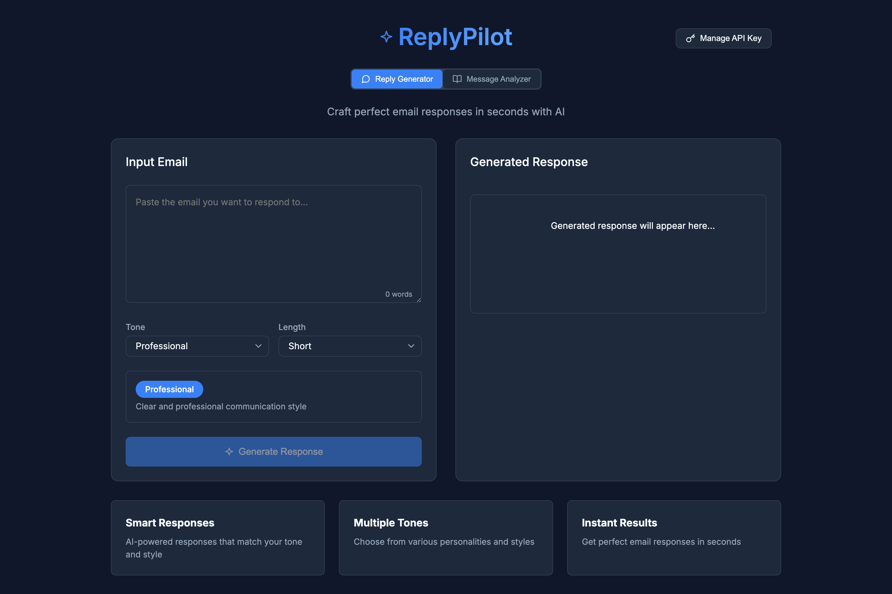

# ReplyPilot 🚀

ReplyPilot is an AI-powered web application that helps users craft perfect email responses and analyze messages. It combines email response generation with advanced text analysis capabilities, all in a modern, responsive interface.



## 🌟 Features

### Email Response Generator
- **Smart Response Generation**: AI-powered responses tailored to your needs
- **Multiple Tone Options**:
  - Professional (Professional, Formal, Friendly, Casual)
  - Fun & Creative (Humorous, Sarcastic, Medieval Knight, Pirate, Shakespeare)
  - Personal (Love Letter, Poetic, Motivational, Thankful)
  - Special (Detective, Sci-Fi Captain, Wizard, Western Cowboy)
- **Customizable Length**: Choose between short, medium, or detailed responses
- **Real-time Preview**: See tone descriptions before generating
- **One-Click Copy**: Easily copy generated responses to clipboard

### Message Analyzer
- **Grammar Check**:
  - Spelling and grammar corrections
  - Style improvements
  - Punctuation fixes
  - One-click corrections
  - Complete corrected text preview

- **Tone Analysis**:
  - Overall sentiment detection
  - Emotion breakdown (Joy, Sadness, Anger, Fear, Surprise)
  - Key phrase identification
  - Emotional impact assessment
  - Visual emotion meters


## 🚀 Getting Started

### Prerequisites
- xAI API key (Get one at [xAI Console](https://x.ai))
- Modern web browser (Chrome, Firefox, Safari, Edge)

### Installation

1. Clone the repository:
```bash
git clone https://github.com/introvertmac/ReplyPilot
```

2. Navigate to the project directory:
```bash
cd replyPilot
```

3. Open `index.html` in your browser or serve with a local server:
```bash
python -m http.server 8000
# or
npx serve
```

4. Enter your xAI API key when prompted on first use.

## 💻 Usage

### Reply Generator Mode

1. Click "Reply Generator" in the mode toggle
2. Paste the email you want to respond to
3. Select desired tone and length
4. Click "Generate Response"
5. Use regenerate or copy buttons as needed

### Message Analyzer Mode

1. Click "Message Analyzer" in the mode toggle
2. Paste the text you want to analyze
3. Select analysis options (Grammar, Tone, Statistics)
4. Click "Analyze Message"
5. Navigate results using the tabs
6. Apply suggested corrections with one click

## ⚙️ Technical Details

### Built With
- HTML5
- CSS3 (Modern CSS features)
- Vanilla JavaScript (ES6+)
- xAI API

### Key Technical Features
- Responsive design for all devices
- Progressive Web App (PWA) support
- Real-time streaming responses
- Modern animations and transitions
- Accessible (WCAG 2.1 compliant)
- Dark mode optimized

## 🔒 Privacy & Security

- API keys are stored locally in the browser
- No data is stored on servers
- All analysis is performed through secure API calls
- HTTPS required for production use

## 🎯 Best Practices

- Input at least 2 words for response generation
- Input at least 5 words for tone analysis
- Use appropriate tone for your context
- Review and customize generated responses
- Consider your audience when selecting tones


## 🔧 Troubleshooting

Common issues and solutions:

1. **API Key Invalid**
   - Verify key is correct
   - Check API key permissions
   - Ensure key is active

2. **Generation Failed**
   - Check internet connection
   - Verify input length
   - Try regenerating

3. **Analysis Not Working**
   - Ensure text is long enough
   - Check selected options
   - Verify API key permissions

## 🤝 Contributing

1. Fork the repository
2. Create your feature branch
3. Commit your changes
4. Push to the branch
5. Create a Pull Request

## 📄 License

This project is licensed under the MIT License 

## 🙏 Acknowledgments

- xAI for their powerful API
- Contributors and testers
- Open source community

## 💫 Future Plans

- Custom tone creation
- Multiple language support
- Team collaboration features
- Template management
- Export/import capabilities
- Integration with email clients


---

Made with ❤️ by [Manish](https://github.com/introvertmac)